# PORA Academy — Data Analysis & AI Automation (Cohort 7)

Instructor repository for the full programme curriculum, session materials, and datasets.

---

## Programme Overview

| Item | Detail |
|---|---|
| **Total duration** | ~56 weeks (~14 months) |
| **Session format** | Wednesday + Thursday, twice weekly |
| **Class size** | 120 students → 12 in-class groups of 10 → 4 project teams of 30 |
| **Project teams** | Revealed at Week 7 of Phase 1; same teams carry through Phase 2c |
| **AI tool** | DeepSeek (introduced Week 4 of each Phase 2 language) |
| **Infrastructure** | Google Colab (Phases 1–2c); self-hosted n8n + NocoDB on Coolify (Phase 3) |
| **Teaching team** | Annet, Samuel, Becky (Phases 1–2); solo (Phase 3) |

---

## Course Progression

```mermaid
flowchart TD
    A([🎓 Cohort 7 Start]) --> P1

    subgraph P1["Phase 1 — Excel  (9 weeks)"]
        direction TB
        P1T["6 weeks teaching\nData import · Formulas · Pivot tables\nPower Query"]
        P1P["2 weeks project\n4 groups × different dataset"]
        P1B["1 week break"]
        P1T --> P1P --> P1B
    end

    P1 --> P2A

    subgraph P2A["Phase 2a — Python  (9 weeks)"]
        direction TB
        P2AT["8 weeks teaching\nWks 1–3: no AI\nWks 4–8: DeepSeek-assisted\npandas · GroupBy · Merging · Streamlit"]
        P2AB["1 week break"]
        P2AT --> P2AB
    end

    P2A --> P2B

    subgraph P2B["Phase 2b — SQL  (9 weeks)"]
        direction TB
        P2BT["8 weeks teaching\nWks 1–3: no AI\nWks 4–8: DeepSeek-assisted\nSQLite · JOINs · CTEs · Window Functions"]
        P2BB["1 week break"]
        P2BT --> P2BB
    end

    P2B --> P2C

    subgraph P2C["Phase 2c — Capstone  (5 weeks)"]
        direction TB
        P2CT["4 weeks\nStreamlit dashboard\nPython + SQL on Olist\nDeployed to Streamlit Community Cloud"]
        P2CB["1 week break"]
        P2CT --> P2CB
    end

    P2C --> P3

    subgraph P3["Phase 3 — AI Automation  (24 weeks)"]
        direction TB
        M1["Module 1 · Foundations\nWks 1–2 · NocoDB + n8n basics"]
        M2["Module 2 · Marketing Automation\nWks 3–6 · AI content · CRM · Social media"]
        M3["Module 3 · Revenue Operations\nWks 7–10 · Orders · Invoicing · Payments"]
        M4["Module 4 · Business Operations\nWks 11–14 · Inventory · Logistics"]
        M5["Module 5 · Integration & AI\nWks 15–19 · AI Agents · Prompt Engineering · RAG"]
        M6["Module 6 · Client-Facing\nWks 20–21 · Order form · Status page · Dashboard"]
        M7["Module 7 · Capstone\nWks 22–24 · New business · Full system · Presentations"]
        M1 --> M2 --> M3 --> M4 --> M5 --> M6 --> M7
    end

    P3 --> Z([🏁 Programme Complete])

    style P1 fill:#e8f4e8,stroke:#4caf50
    style P2A fill:#e3f2fd,stroke:#2196f3
    style P2B fill:#e3f2fd,stroke:#2196f3
    style P2C fill:#e8eaf6,stroke:#7986cb
    style P3 fill:#fff8e1,stroke:#ffc107
```



---

## Repository Structure

```
data-analysis-and-ai-automation-course-cohort-7/
│
├── curriculum/
│   ├── phase-1-excel/
│   │   ├── teaching-curriculum.md          ← session-by-session plan (Weeks 1–6)
│   │   ├── weeks-01-06-teaching/           ← per-session folders (see convention below)
│   │   ├── projects/                       ← group project briefs (4 files)
│   │   └── resources/                      ← formula cheatsheet, keyboard shortcuts, PQ reference
│   │
│   ├── phase-2a-python/
│   │   ├── teaching-curriculum.md
│   │   └── weeks-01-08-teaching/
│   │
│   ├── phase-2b-sql/
│   │   ├── teaching-curriculum.md
│   │   └── weeks-01-08-teaching/
│   │
│   ├── phase-2c-capstone/
│   │   └── teaching-curriculum.md          ← 4-week Streamlit dashboard project (4 groups)
│   │
│   └── phase-3-ai-automation/
│       ├── teaching-curriculum.md          ← full 24-week Ready Delight curriculum
│       └── weeks-01-24-teaching/
│
└── datasets/
    ├── phase-1-excel/
    │   ├── teaching/                       ← data.csv (UCI Online Retail, 541,909 rows)
    │   └── projects/
    │       ├── group-1-customer-satisfaction/   ← Reviews_sample_50k.csv + Reviews.csv
    │       ├── group-2-product-performance/     ← Sample - Superstore.csv
    │       ├── group-3-publishing-intelligence/ ← bestsellers with categories.csv
    │       └── group-4-uk-retail-revenue/       ← README.md (uses teaching/data.csv)
    │
    └── phase-2-python-sql/                 ← 11 Olist CSVs (used by Phase 2a, 2b, 2c)
```

---

## Phase Reference

| Phase | Tool | Session length | Weeks | Dataset | Teaching curriculum |
|---|---|---|---|---|---|
| **1 — Excel** | Microsoft Excel | 2 hrs | 6 teaching + 2 project | UCI Online Retail (teaching); 4 group datasets | `curriculum/phase-1-excel/teaching-curriculum.md` |
| **2a — Python** | Google Colab + pandas | 2 hrs | 8 | Olist (11 CSVs) | `curriculum/phase-2a-python/teaching-curriculum.md` |
| **2b — SQL** | Google Colab + SQLite | 2 hrs | 8 | Olist (SQLite in-memory) | `curriculum/phase-2b-sql/teaching-curriculum.md` |
| **2c — Capstone** | Streamlit + GitHub | 2 hrs | 4 | Olist | `curriculum/phase-2c-capstone/teaching-curriculum.md` |
| **3 — AI Automation** | n8n + NocoDB + Streamlit | 90 min | 24 | Ready Delight Foods (NocoDB) | `curriculum/phase-3-ai-automation/teaching-curriculum.md` |

---

## Folder Convention

All teaching phases use the same per-session folder pattern:

```
weeks-NN-MM-teaching/
└── week-NN-topic-slug/
    ├── 01-wednesday/
    │   ├── lesson-plan.md          ← pre-filled template; fill before each session
    │   ├── lecture-materials/      ← demo files (notebooks/ or workflows/ subfolder)
    │   ├── exercises/              ← distributed to students during session
    │   └── solutions/              ← instructor reference; do not share early
    └── 02-thursday/
        └── (same structure)
```

**`lecture-materials/` subfolder by phase:**

| Phase | Subfolder | Contents |
|---|---|---|
| 1 — Excel | *(flat)* | Excel demo workbooks |
| 2a — Python | `notebooks/` | Colab `.ipynb` demo notebooks |
| 2b — SQL | `notebooks/` | Colab `.ipynb` demo notebooks |
| 3 — AI Automation | `workflows/` | n8n workflow `.json` exports |

---

## Datasets Reference

### Phase 1 — Excel

| Group | File | Rows | Location |
|---|---|---|---|
| Teaching (Wks 1–6) | `data.csv` | 541,909 | `datasets/phase-1-excel/teaching/` |
| Group 1 — Customer Satisfaction | `Reviews_sample_50k.csv` | 50,000 | `datasets/phase-1-excel/projects/group-1-customer-satisfaction/` |
| Group 2 — Product Performance | `Sample - Superstore.csv` | 9,994 | `datasets/phase-1-excel/projects/group-2-product-performance/` |
| Group 3 — Publishing Intelligence | `bestsellers with categories.csv` | 550 | `datasets/phase-1-excel/projects/group-3-publishing-intelligence/` |
| Group 4 — UK Retail Revenue | *(same as teaching)* | 541,909 | `datasets/phase-1-excel/teaching/data.csv` |

### Phases 2a / 2b / 2c — Olist

All three phases use the same 11 CSVs in `datasets/phase-2-python-sql/`. Upload the entire folder to a shared Google Drive at programme start; students mount in every Colab session.

| File | Rows | Key use |
|---|---|---|
| `olist_orders_dataset.csv` | 99,441 | Core order facts |
| `olist_customers_dataset.csv` | 99,441 | Customer state/city |
| `olist_order_items_dataset.csv` | 112,650 | Revenue, products per order |
| `olist_products_dataset.csv` | 32,951 | Category (has nulls + column name typo) |
| `olist_order_reviews_dataset.csv` | 99,224 | Review scores |
| `olist_order_payments_dataset.csv` | 103,886 | Payment type, instalments |
| `olist_sellers_dataset.csv` | 3,095 | Seller state |
| `product_category_name_translation.csv` | 71 | English category names |
| `olist_geolocation_dataset.csv` | 1,000,163 | Lat/lon (Phase 3 optional) |

**Key verified Olist stats** (embedded throughout Phase 2a/2b/2c curricula):
- Total orders: **99,441** · Delivered: **96,478 (97%)** · GMV: **R$15,843,553.24**
- Avg delivery: **12.6 days** · Late: **7,826 (8.1%)** · Peak month: **Nov 2017 — 7,544 orders**
- Avg review score: **4.09** · Top category: **health_beauty — R$1,258,681.34**

### Phase 3 — Ready Delight Foods

Data is created by students inside NocoDB during Module 1. There is no pre-existing CSV. The NocoDB instance is provisioned on the shared Coolify server before Week 1.

---

## Curriculum Principles

1. **Data-first** — every formula, query, and expected output in a teaching curriculum was verified by running code against the actual dataset before being written. No expected answer is assumed.
2. **No placement tests** — assessment is weekly assignments only.
3. **AI gating** — in Phases 2a and 2b, DeepSeek is introduced at Week 4 (not Week 1). Students must be able to read and explain every line of AI-generated code.
4. **Verified benchmarks** — each curriculum embeds verified output values. If a student's answer differs from a verified value, the code is wrong — not the curriculum.
